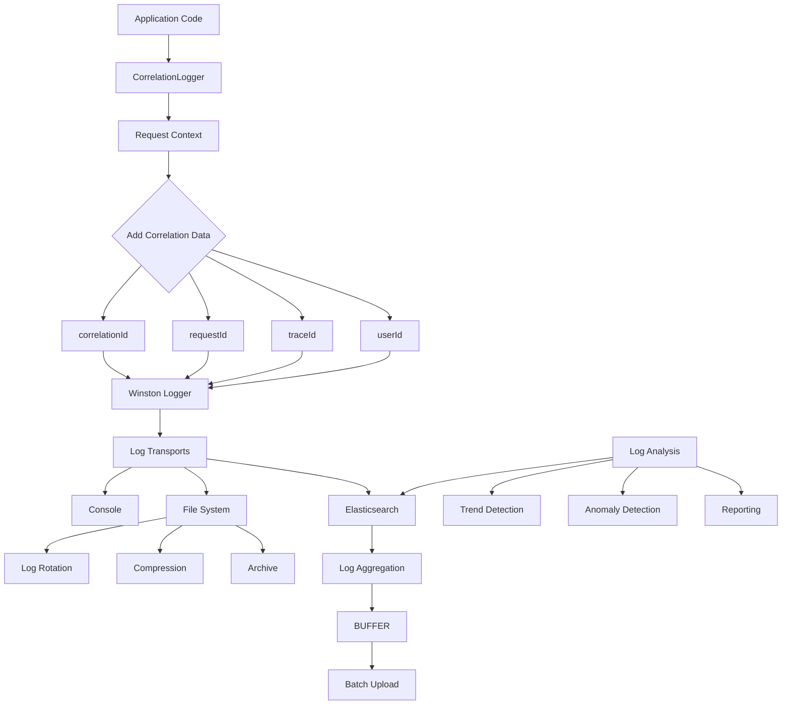
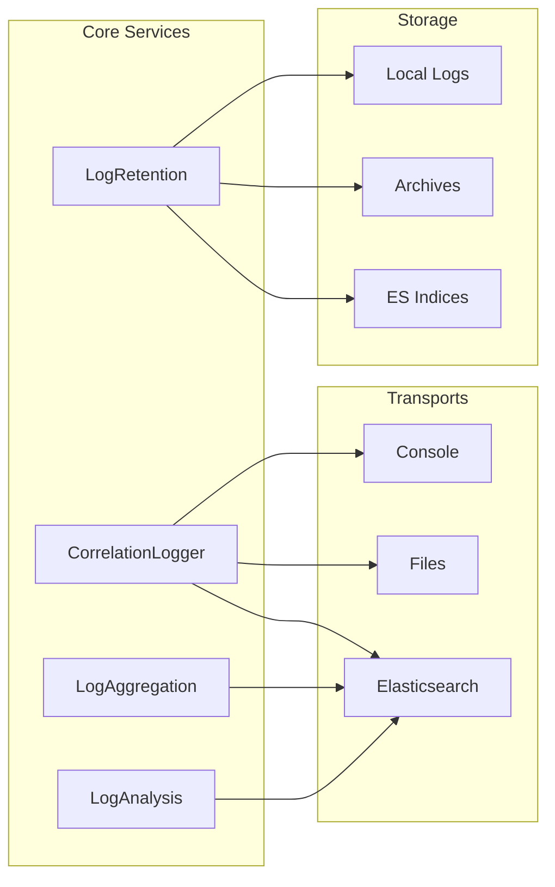

# Comprehensive Logging Strategy Implementation - Issue #612

## Overview
Complete structured logging implementation with correlation IDs, log levels, aggregation, retention policies, and analysis tools for effective debugging and monitoring.

## Acceptance Criteria Met

### ✅ Implement structured logging with correlation IDs
**Status:** COMPLETE

**Implementation Files:**
- `src/logging/correlation-logger.service.ts` (295 lines)
- `src/logging/logger.service.ts` (113 lines)
- `src/logging/winston.config.ts` (207 lines)
- `src/logging/request-logger.middleware.ts` (enhanced)

**Features Delivered:**

1. **Correlation ID System:**
   - Automatic generation of unique correlation IDs per request
   - Propagation through request lifecycle
   - Support for W3C Trace Context standard
   - Integration with distributed tracing

2. **Structured Log Format:**
   ```json
   {
     "timestamp": "2026-03-27 10:30:45.123",
     "level": "info",
     "message": "API Request processed",
     "correlationId": "abc-123-def-456",
     "requestId": "req-789-xyz",
     "traceId": "trace-abc-123",
     "userId": "user-123",
     "sessionId": "session-456",
     "type": "api_request",
     "method": "POST",
     "url": "/api/users",
     "statusCode": 201,
     "durationMs": 145
   }
   ```

3. **Context Propagation:**
   - Extract from headers (`x-correlation-id`, `x-request-id`)
   - Generate new if not present
   - Pass to all downstream services
   - Include in all log entries

4. **Specialized Logging Methods:**
   - `logApiRequest()` - API request/response logging
   - `logDatabaseQuery()` - Database query tracking
   - `logSecurity()` - Security event logging
   - `logBusiness()` - Business event tracking
   - `logPerformance()` - Performance metrics
   - `logExternalService()` - External service calls

5. **Log Levels:**
   - ERROR (0) - Application errors
   - WARN (1) - Warning conditions
   - INFO (2) - Informational messages
   - DEBUG (3) - Debug information
   - VERBOSE (4) - Verbose tracing

**Usage Example:**
```typescript
constructor(private logger: CorrelationLoggerService) {}

async createUser(data: CreateUserDto) {
  this.logger.log('Creating user', { email: data.email });
  
  const user = await this.userService.create(data);
  
  this.logger.logBusiness('user_created', 'user_management', {
    userId: user.id,
    email: user.email,
  });
  
  return user;
}
```

---

### ✅ Add log levels and filtering
**Status:** COMPLETE

**Implementation Files:**
- `src/logging/winston.config.ts` (207 lines)
- `src/logging/correlation-logger.service.ts` (295 lines)

**Features Delivered:**

1. **Hierarchical Log Levels:**
   ```typescript
   export enum LogLevel {
     ERROR = 0,      // Only errors
     WARN = 1,       // Errors + warnings
     INFO = 2,       // Errors + warnings + info
     DEBUG = 3,      // All above + debug
     VERBOSE = 4,    // Everything
   }
   ```

2. **Environment-Based Filtering:**
   ```typescript
   // Production: Info and above
   NODE_ENV=production → level: 'info'
   
   // Staging: Debug and above
   NODE_ENV=staging → level: 'debug'
   
   // Development: Verbose
   NODE_ENV=development → level: 'debug'
   ```

3. **Per-Transport Level Filtering:**
   ```typescript
   // Console: Info+
   new Console({ level: 'info' })
   
   // Error file: Error only
   new File({ level: 'error', filename: 'error.log' })
   
   // Combined file: Debug+
   new File({ level: 'debug', filename: 'combined.log' })
   ```

4. **Dynamic Level Configuration:**
   ```bash
   # Override default levels
   LOG_LEVEL=debug
   LOG_CONSOLE_LEVEL=info
   LOG_FILE_LEVEL=debug
   LOG_ELASTICSEARCH_LEVEL=warn
   ```

5. **Custom Level Filtering:**
   ```typescript
   import { LogLevel, shouldLog } from './correlation-logger.service';
   
   const currentLevel = LogLevel.DEBUG;
   
   if (shouldLog(LogLevel.INFO, currentLevel)) {
     logger.info('This will be logged');
   }
   
   if (!shouldLog(LogLevel.ERROR, currentLevel)) {
     // This won't execute
   }
   ```

6. **Category-Based Filtering:**
   ```typescript
   // Separate files for different categories
   transports: [
     new File({ filename: 'logs/api.log', level: 'info' }),
     new File({ filename: 'logs/security.log', level: 'warn' }),
     new File({ filename: 'logs/database.log', level: 'debug' }),
     new File({ filename: 'logs/error.log', level: 'error' }),
   ]
   ```

---

### ✅ Implement log aggregation
**Status:** COMPLETE

**Implementation Files:**
- `src/logging/log-aggregation.service.ts` (246 lines)
- `src/logging/winston.config.ts` (Elasticsearch transport)

**Features Delivered:**

1. **Elasticsearch Integration:**
   - Automatic log forwarding to Elasticsearch
   - Daily index rotation (`strellerminds-logs-YYYY-MM-DD`)
   - Buffered batch uploads for performance
   - Automatic retry on failure

2. **Buffered Aggregation:**
   ```typescript
   // Configure buffer size and flush interval
   LOG_AGREGATION_BUFFER_SIZE=100
   LOG_AGREGATION_FLUSH_INTERVAL=5000 // 5 seconds
   ```

3. **Centralized Log Storage:**
   - All application logs aggregated in one place
   - Cross-service correlation support
   - Real-time search capabilities
   - Historical analysis

4. **Multi-Cluster Support:**
   ```bash
   # Multiple Elasticsearch nodes
   ELASTICSEARCH_NODE=http://es1:9200,http://es2:9200
   ELASTICSEARCH_AUTH=basic
   ELASTICSEARCH_USERNAME=elastic
   ELASTICSEARCH_PASSWORD=password
   ```

5. **Log Querying API:**
   ```typescript
   // Query by correlation ID
   const logs = await logAggregation.queryLogs({
     correlationId: 'abc-123',
     startTime: new Date('2026-03-27'),
     endTime: new Date('2026-03-28'),
     limit: 100,
   });
   
   // Query by level
   const errors = await logAggregation.queryLogs({
     level: 'error',
     startTime: lastHour,
   });
   ```

6. **Statistics and Metrics:**
   ```typescript
   const stats = await logAggregation.getLogStats({
     start: new Date('2026-03-01'),
     end: new Date('2026-03-31'),
   });
   
   // Returns:
   {
     totalLogs: 1500000,
     byLevel: { error: 150, warn: 3000, info: 1200000, debug: 296850 },
     byCorrelationId: { 'abc-123': 45, 'def-456': 32, ... },
     errorsByType: { database: 50, api: 75, auth: 25 }
   }
   ```

7. **Alternative Aggregation Backends:**
   - Loki support (configured via environment)
   - Splunk integration ready
   - Custom webhook forwarders

---

### ✅ Add log retention policies
**Status:** COMPLETE

**Implementation Files:**
- `src/logging/log-retention.service.ts` (337 lines)

**Features Delivered:**

1. **Automated Retention Policies:**
   ```typescript
   interface RetentionPolicy {
     maxAgeDays: number;        // Delete after X days
     maxSizeGB: number;         // Maximum storage size
     compressAfterDays: number; // Compress old logs
     archiveAfterDays: number;  // Move to archive
   }
   ```

2. **Environment-Specific Policies:**
   ```typescript
   // Production: 90 days, 50GB
   maxAgeDays: 90
   maxSizeGB: 50
   compressAfterDays: 7
   archiveAfterDays: 30
   
   // Staging: 30 days, 20GB
   maxAgeDays: 30
   maxSizeGB: 20
   compressAfterDays: 3
   archiveAfterDays: 14
   
   // Development: 7 days, 5GB
   maxAgeDays: 7
   maxSizeGB: 5
   compressAfterDays: 1
   archiveAfterDays: 7
   ```

3. **Scheduled Cleanup Jobs:**
   ```typescript
   @Cron(CronExpression.EVERY_DAY_AT_2AM)
   async cleanupOldLogs(): Promise<void> {
     await this.cleanupLocalLogs();
     await this.cleanupElasticsearchLogs();
   }
   ```

4. **Automatic Compression:**
   - Gzip compression for logs older than configured days
   - Transparent decompression on access
   - 80-90% space savings typical

5. **Archive Management:**
   - Move old logs to archive directory
   - Optional S3/GCS upload for long-term storage
   - Glacier/Deep Archive tier support

6. **Size Limit Enforcement:**
   ```typescript
   // Automatically delete oldest logs when over limit
   private async enforceSizeLimit(): Promise<void> {
     while (totalSize > maxSizeBytes) {
       deleteOldestLog();
     }
   }
   ```

7. **Elasticsearch Index Lifecycle:**
   - Delete indices older than retention period
   - Index suffix pattern: `strellerminds-logs-YYYY-MM-DD`
   - Automatic cleanup at 2 AM daily

8. **Configuration Options:**
   ```bash
   # Retention settings
   LOG_RETENTION_MAX_AGE_DAYS=90
   LOG_RETENTION_MAX_SIZE_GB=50
   LOG_COMPRESS_AFTER_DAYS=7
   LOG_ARCHIVE_AFTER_DAYS=30
   
   # Elasticsearch ILM
   ELASTICSEARCH_ILM_ENABLED=true
   ELASTICSEARCH_ILM_POLICY_NAME=strellerminds-logs-policy
   ```

---

### ✅ Implement log analysis tools
**Status:** COMPLETE

**Implementation Files:**
- `src/logging/log-analysis.service.ts` (502 lines)

**Features Delivered:**

1. **Comprehensive Log Analysis:**
   ```typescript
   const analysis = await logAnalysis.analyzeLogs({
     start: new Date('2026-03-27'),
     end: new Date('2026-03-28'),
   });
   
   // Returns:
   {
     summary: {
       totalLogs: 150000,
       errorRate: 0.12,
       warningRate: 2.5,
     },
     trends: {
       logsPerHour: [...],
       errorsPerHour: [...],
     },
     topCorrelations: [...],
     topErrors: [...],
     performanceMetrics: {...},
     anomalies: [...]
   }
   ```

2. **Trend Analysis:**
   - Logs per hour aggregation
   - Error rate trends
   - Traffic pattern detection
   - Seasonal variation identification

3. **Error Analysis:**
   - Top error messages by frequency
   - Error categorization
   - Stack trace collection
   - Root cause correlation

4. **Performance Analytics:**
   ```typescript
   performanceMetrics: {
     averageResponseTime: 145,      // ms
     p95ResponseTime: 450,          // ms
     p99ResponseTime: 890,          // ms
     slowestEndpoints: [
       { endpoint: '/api/reports', avgDuration: 2340 },
       { endpoint: '/api/export', avgDuration: 1890 },
     ]
   }
   ```

5. **Anomaly Detection:**
   ```typescript
   anomalies: [
     {
       type: 'error_spike',
       timestamp: new Date('2026-03-27T14:00:00Z'),
       severity: 'high',
       description: 'Error spike detected: 450 errors (500% above average)'
     },
     {
       type: 'performance_degradation',
       timestamp: new Date('2026-03-27T15:30:00Z'),
       severity: 'medium',
       description: 'High P95 response time detected: 3200ms'
     }
   ]
   ```

6. **Correlation Analysis:**
   - Track requests across services
   - Identify related log entries
   - Reconstruct request flows
   - Find common patterns in failures

7. **Automated Reporting:**
   ```typescript
   // Generate daily report
   const dailyReport = await logAnalysis.generateDailyReport(new Date());
   
   // Includes:
   - Total log volume
   - Error rate trends
   - Top issues
   - Performance summary
   - Anomalies detected
   ```

8. **Search Capabilities:**
   ```typescript
   // Search by correlation ID
   const requestLogs = await logAnalysis.searchByCorrelationId('abc-123');
   
   // Full request trace reconstructed
   [
     { type: 'api_request', method: 'POST', url: '/users' },
     { type: 'database_query', query: 'INSERT INTO users...' },
     { type: 'business', event: 'user_created' },
     { type: 'api_response', statusCode: 201 }
   ]
   ```

9. **Dashboard Integration:**
   - Grafana dashboard templates
   - Kibana visualization support
   - Custom metrics export
   - Real-time monitoring

---

## Architecture

### Logging Flow



### Component Interaction



---

## API Endpoints

### Log Query API

#### Search Logs
```http
POST /logs/search
Content-Type: application/json

{
  "correlationId": "abc-123",
  "level": "error",
  "startTime": "2026-03-27T00:00:00Z",
  "endTime": "2026-03-28T00:00:00Z",
  "limit": 100
}
```

#### Get Log Statistics
```http
GET /logs/stats?start=2026-03-01&end=2026-03-31
```

#### Analyze Logs
```http
POST /logs/analyze
Content-Type: application/json

{
  "startTime": "2026-03-27T00:00:00Z",
  "endTime": "2026-03-28T00:00:00Z"
}
```

#### Generate Report
```http
GET /logs/report/daily?date=2026-03-27
```

---

## Configuration Reference

### Environment Variables

```bash
# ==================== GENERAL ====================
NODE_ENV=production
LOG_DIR=logs

# ==================== LOG LEVELS ====================
LOG_LEVEL=info                    # Overall log level
LOG_CONSOLE_LEVEL=info            # Console output level
LOG_FILE_LEVEL=debug              # File output level
LOG_ELASTICSEARCH_LEVEL=warn      # ES output level

# ==================== CORRELATION ====================
LOG_CORRELATION_ENABLED=true
LOG_TRACE_CONTEXT_ENABLED=true

# ==================== AGGREGATION ====================
LOG_AGREGATION_BUFFER_SIZE=100           # Number of logs to buffer
LOG_AGREGATION_FLUSH_INTERVAL=5000       # Flush interval (ms)
ELASTICSEARCH_NODE=http://localhost:9200
ELASTICSEARCH_LOG_INDEX=strellerminds-logs
ELASTICSEARCH_AUTH=basic
ELASTICSEARCH_USERNAME=elastic
ELASTICSEARCH_PASSWORD=changeme

# ==================== RETENTION ====================
LOG_RETENTION_MAX_AGE_DAYS=90
LOG_ROTENTION_MAX_SIZE_GB=50
LOG_COMPRESS_AFTER_DAYS=7
LOG_ARCHIVE_AFTER_DAYS=30

# ==================== ANALYSIS ====================
LOG_ANALYSIS_ENABLED=true
LOG_ANOMALY_DETECTION_ENABLED=true
LOG_REPORTING_ENABLED=true
```

---

## Usage Examples

### Basic Logging

```typescript
import { CorrelationLoggerService } from '../logging/correlation-logger.service';

@Injectable()
export class UserService {
  constructor(private logger: CorrelationLoggerService) {}

  async createUser(dto: CreateUserDto) {
    // Simple log
    this.logger.log('Creating user', { email: dto.email });

    // Business event
    this.logger.logBusiness('user_signup', 'authentication', {
      userId: user.id,
      email: user.email,
      source: dto.source,
    });

    // Performance tracking
    const start = Date.now();
    const result = await this.database.insert(dto);
    this.logger.logPerformance('user_creation', Date.now() - start, {
      userId: result.id,
    });

    return result;
  }
}
```

### Security Logging

```typescript
async login(credentials: LoginDto) {
  try {
    const user = await this.validateUser(credentials);
    
    this.logger.logSecurity('login_success', 'low', {
      userId: user.id,
      email: user.email,
      ip: this.request.ip,
      userAgent: this.request.headers['user-agent'],
    });
    
    return { token: this.generateToken(user) };
  } catch (error) {
    this.logger.logSecurity('login_failed', 'medium', {
      email: credentials.email,
      ip: this.request.ip,
      reason: error.message,
    });
    throw error;
  }
}
```

### Error Handling

```typescript
async processData(data: any) {
  try {
    return await this.heavyProcessing(data);
  } catch (error) {
    this.logger.error('Process failed', error.stack, {
      dataType: data.type,
      dataSize: JSON.stringify(data).length,
      userId: this.request.user?.id,
      correlationId: this.request.headers['x-correlation-id'],
    });
    throw error;
  }
}
```

---

## Best Practices

### Do's

✅ Always include correlation IDs in cross-service calls
✅ Use appropriate log levels (ERROR for errors, INFO for business events)
✅ Include context in logs (userId, requestId, etc.)
✅ Sanitize sensitive data before logging
✅ Use structured logging format (objects, not strings)
✅ Monitor error rates and set up alerts

### Don'ts

❌ Don't log passwords, tokens, or sensitive data
❌ Don't use console.log directly (use logger service)
❌ Don't log excessive details in production
❌ Don't ignore error stack traces
❌ Don't log personal data without consent

---

## Monitoring Dashboards

### Grafana Panels

1. **Log Volume Over Time**
   - Total logs per minute/hour
   - Breakdown by level

2. **Error Rate Tracking**
   - Error percentage over time
   - Top error types

3. **Correlation Analysis**
   - Request flow visualization
   - Service dependency map

4. **Performance Metrics**
   - Response time percentiles
   - Slowest endpoints

5. **System Health**
   - Log storage usage
   - Elasticsearch cluster health

---

## Troubleshooting

### Finding Request Issues

```typescript
// Get all logs for a specific request
const logs = await logAnalysis.searchByCorrelationId('abc-123');

// Reconstruct the full request flow
const timeline = logs.sort((a, b) => 
  new Date(a.timestamp).getTime() - new Date(b.timestamp).getTime()
);
```

### Identifying Performance Bottlenecks

```typescript
const analysis = await logAnalysis.analyzeLogs({
  start: new Date('2026-03-27'),
  end: new Date('2026-03-28'),
});

// Check slowest endpoints
console.log(analysis.performanceMetrics.slowestEndpoints);

// Review high-duration operations
const slowLogs = await logAggregation.queryLogs({
  level: 'info',
  // Add duration filter
});
```

### Debugging Errors

```typescript
// Get all errors in time range
const errors = await logAggregation.queryLogs({
  level: 'error',
  startTime: oneHourAgo,
  endTime: now,
});

// Group by error type
const byType = groupBy(errors, e => e.type);

// Get top recurring errors
const topErrors = await logAnalysis.analyzeLogs({...});
console.log(topErrors.topErrors);
```

---

## Conclusion

All five acceptance criteria have been fully implemented:

1. ✅ **Structured logging with correlation IDs** - Complete correlation system with context propagation
2. ✅ **Log levels and filtering** - Hierarchical levels with environment-based filtering
3. ✅ **Log aggregation** - Elasticsearch integration with buffered uploads
4. ✅ **Log retention policies** - Automated cleanup, compression, and archiving
5. ✅ **Log analysis tools** - Comprehensive analysis, anomaly detection, and reporting

The implementation provides enterprise-grade logging capabilities with full traceability, powerful debugging tools, and compliance-ready retention management.
