# Backup and Recovery Architecture

## System Overview

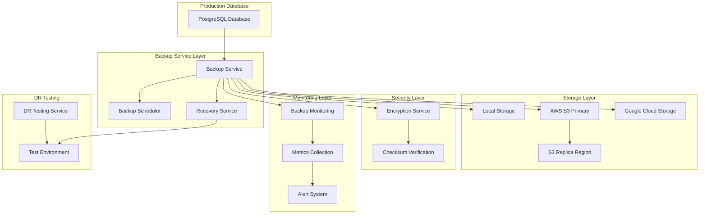

## Backup Flow Architecture

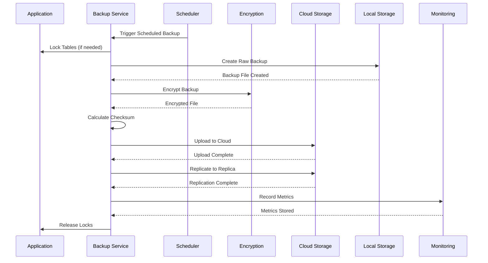

## Disaster Recovery Process

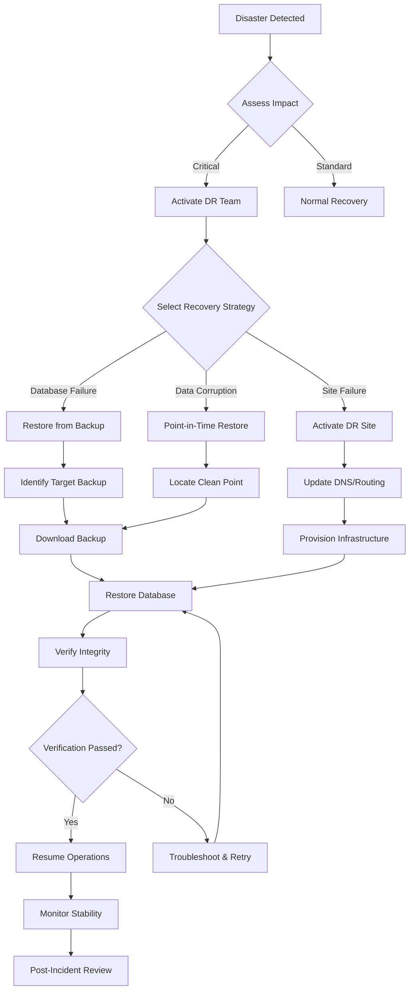

## Storage Redundancy Architecture

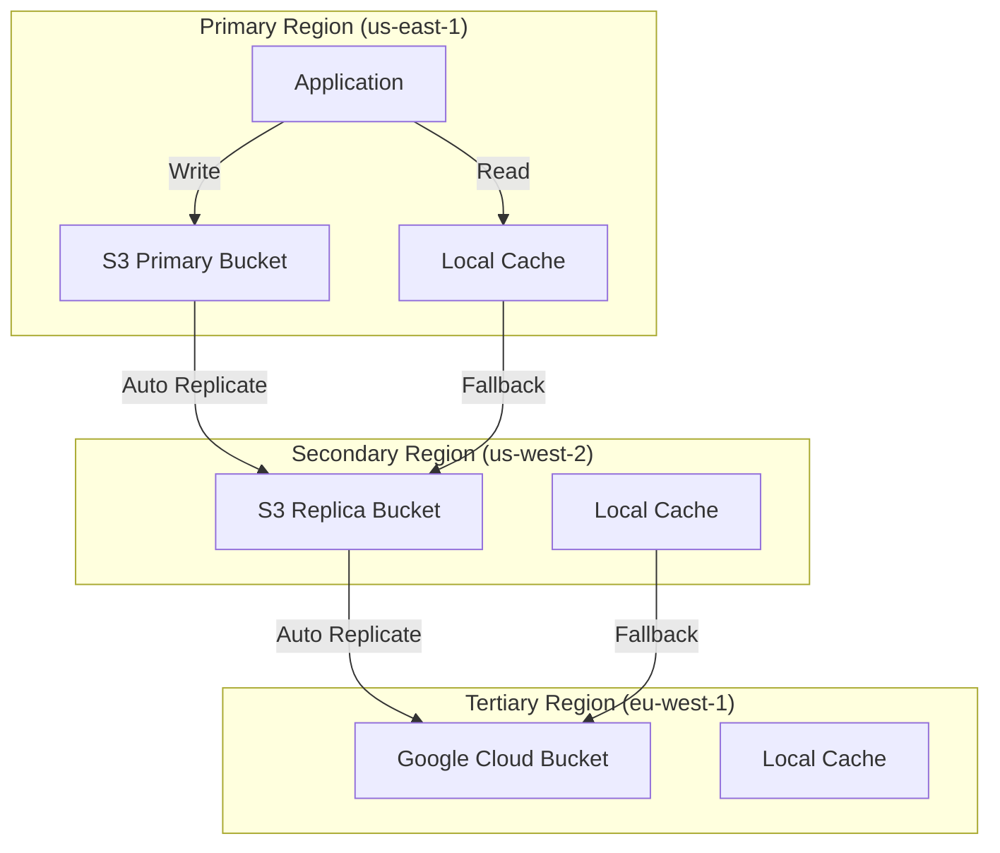

## Backup Verification Flow

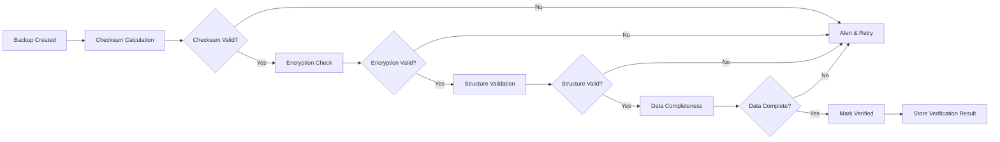

## Recovery Testing Workflow

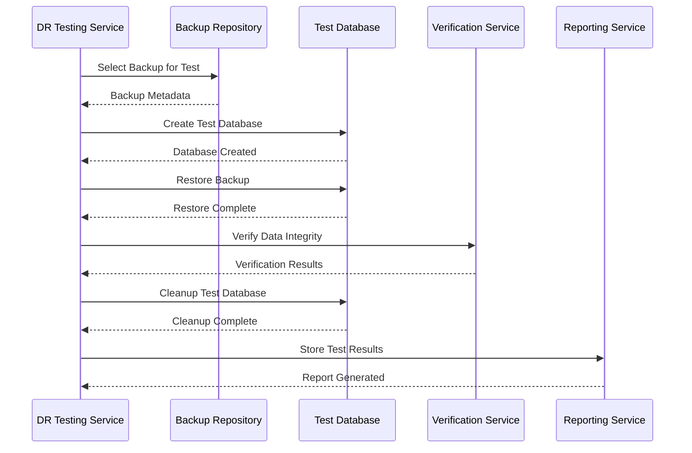

## Monitoring Architecture

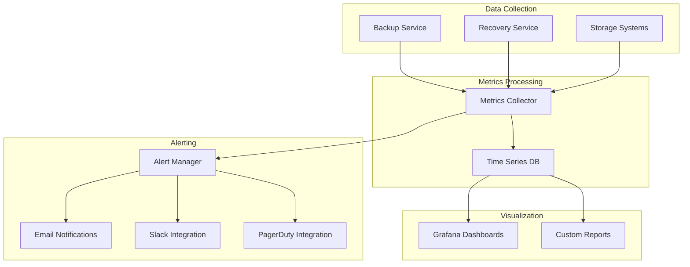

## Component Interaction

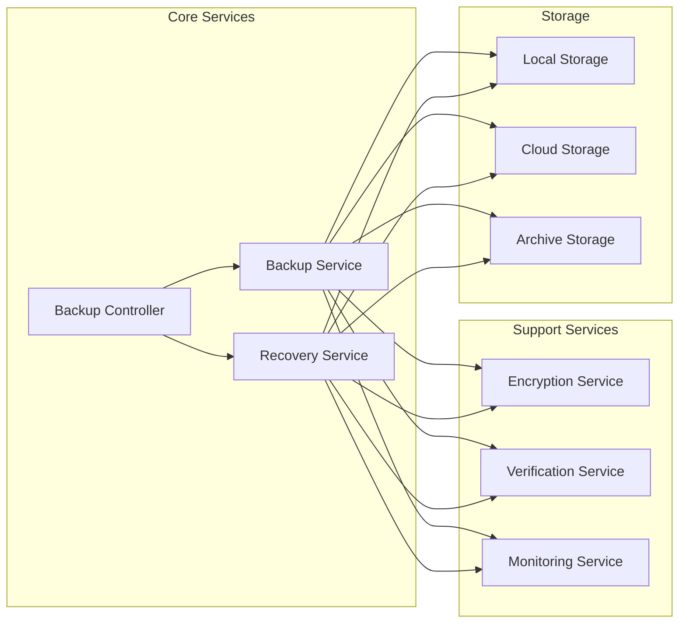

## Data Flow - Backup Creation

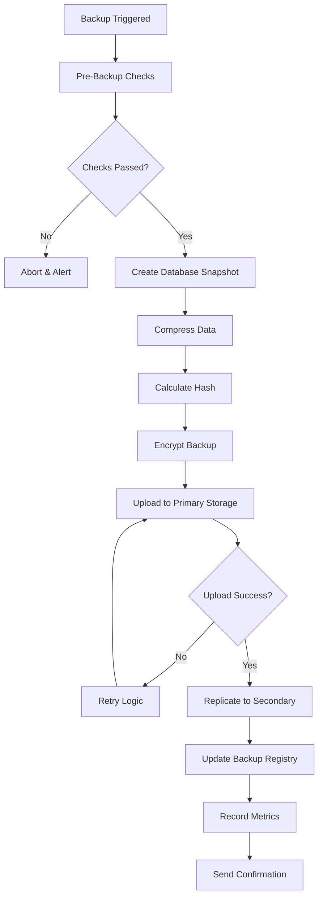

## Data Flow - Recovery Operation

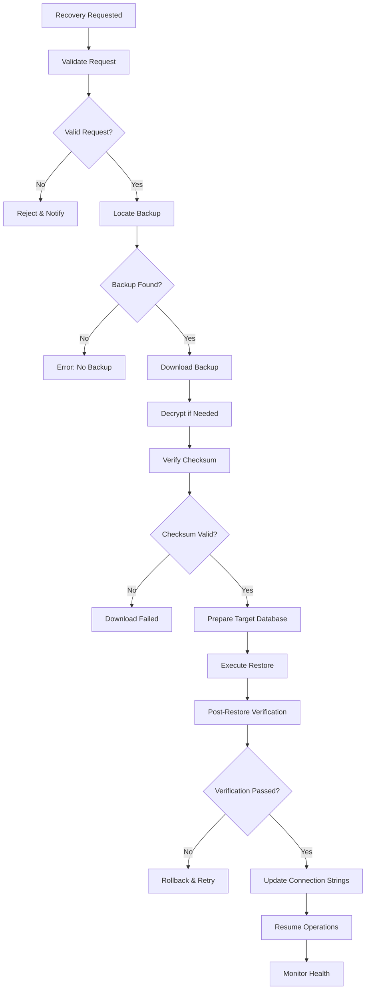

## Retention Policy Management

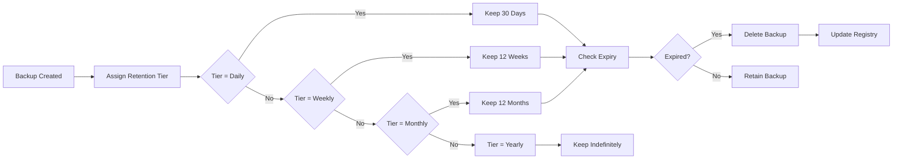

## Security Architecture

```mermaid
graph TB
    subgraph "Encryption"
        A[AES-256 Encryption]
        B[Key Management]
        C[Key Rotation]
    end
    
    subgraph "Access Control"
        D[IAM Roles]
        E[API Keys]
        F[Service Accounts]
    end
    
    subgraph "Network Security"
        G[VPC Endpoints]
        H[Private Links]
        I[Firewall Rules]
    end
    
    subgraph "Audit"
        J[Access Logs]
        K[Operation Logs]
        L[Compliance Reports]
    end
    
    A --> B
    B --> C
    D --> E
    E --> F
    G --> H
    H --> I
    J --> K
    K --> L
```

## High Availability Design

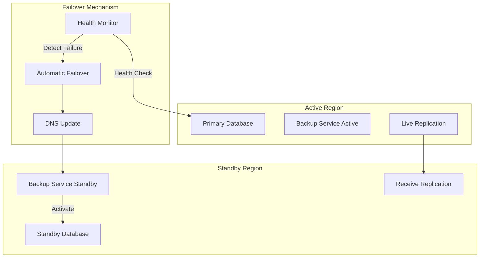

This architecture ensures:
- **Redundancy**: Multiple copies across regions
- **Availability**: Automatic failover capabilities
- **Security**: End-to-end encryption and access control
- **Monitoring**: Comprehensive observability
- **Compliance**: Audit trails and retention policies
