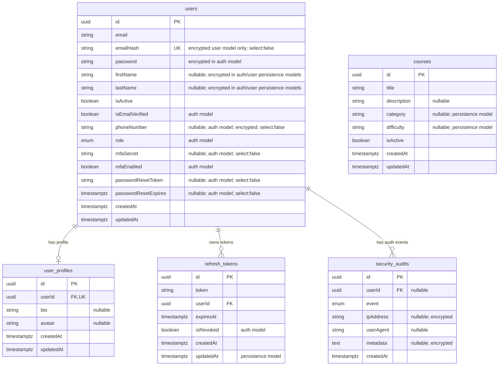

# Database Schema Documentation

This document describes the PostgreSQL schema represented by the current TypeORM entities in the StrellerMinds backend. The application uses `autoLoadEntities: true`; tables are registered from Nest modules through `TypeOrmModule.forFeature(...)`.

## Entity Relationship Diagram

## Relationship Summary

| Relationship | Cardinality | Foreign key | Delete behavior | Source |
| --- | --- | --- | --- | --- |
| `users` to `user_profiles` | One-to-zero-or-one | `user_profiles.userId -> users.id` | `CASCADE` | `src/user/entities/user-profile.entity.ts` |
| `users` to `refresh_tokens` | One-to-many | `refresh_tokens.userId -> users.id` | `CASCADE` | `src/auth/entities/refresh-token.entity.ts` |
| `users` to `security_audits` | One-to-many | `security_audits.userId -> users.id` | `SET NULL` | `src/auth/entities/security-audit.entity.ts` |

`courses` currently has no TypeORM relationships to other tables.

## Tables

### `users`

Stores account, authentication, and profile identity data.

| Column | Type | Nullable | Default | Notes |
| --- | --- | --- | --- | --- |
| `id` | `uuid` | No | generated | Primary key. |
| `email` | `string` | No | none | Encrypted in the auth entity and user persistence entity; unique in legacy/plain entity mappings. |
| `emailHash` | `string` | No | derived | Blind index for encrypted email lookups; unique and `select:false` where present. |
| `password` | `string` | No | none | Encrypted in the auth entity. |
| `firstName` | `string` | Yes | `null` | Encrypted in auth/user persistence entities. |
| `lastName` | `string` | Yes | `null` | Encrypted in auth/user persistence entities. |
| `isActive` | `boolean` | No | `true` | Used for status filtering. |
| `isEmailVerified` | `boolean` | No | `false` | Auth entity only. |
| `phoneNumber` | `string` | Yes | `null` | Encrypted and `select:false` in auth entity. |
| `role` | `enum` | No | `student` | Values come from `src/auth/enums/role.enum.ts`. |
| `mfaSecret` | `string` | Yes | `null` | `select:false`; used for MFA. |
| `mfaEnabled` | `boolean` | No | `false` | Enables or disables MFA. |
| `passwordResetToken` | `string` | Yes | `null` | `select:false`; used during password reset. |
| `passwordResetExpires` | `timestamptz` | Yes | `null` | Password reset expiry. |
| `createdAt` | `timestamptz` | No | generated | Created timestamp. |
| `updatedAt` | `timestamptz` | No | generated | Last update timestamp. |

Indexes:

| Index | Columns | Unique | Purpose |
| --- | --- | --- | --- |
| `IDX_user_email_hash` | `emailHash` | Yes | Login lookup and duplicate registration checks when email is encrypted. |
| `IDX_user_email` | `email` | Yes | Legacy/plain user lookup where the plain user entity is loaded. |
| `IDX_user_isActive` | `isActive` | No | Admin and listing filters. |
| `IDX_user_createdAt` | `createdAt` | No | Time-range reporting and ordering. |
| `IDX_user_updatedAt` | `updatedAt` | No | Updated-at sorting and synchronization queries. |

Implementation notes:

- `src/auth/entities/user.entity.ts` is the most complete mapping for the physical `users` table.
- `src/user/entities/user.entity.ts`, `src/auth/infrastructure/persistence/user-persistence.entity.ts`, and `src/user/infrastructure/persistence/user-persistence.entity.ts` also map to `users`. These alternate mappings expose different subsets of columns for module-specific or clean-architecture persistence use.
- `emailHash` is generated in `@BeforeInsert`/`@BeforeUpdate` hooks using `EncryptionService.hash(email.toLowerCase())`.

### `user_profiles`

Stores optional profile details for a user.

| Column | Type | Nullable | Default | Notes |
| --- | --- | --- | --- | --- |
| `id` | `uuid` | No | generated | Primary key. |
| `userId` | `uuid` | No | none | Unique foreign key to `users.id`. |
| `bio` | `string` | Yes | `null` | Profile biography. |
| `avatar` | `string` | Yes | `null` | Avatar URL or storage key. |
| `createdAt` | `timestamptz` | No | generated | Created timestamp. |
| `updatedAt` | `timestamptz` | No | generated | Last update timestamp. |

Indexes:

| Index | Columns | Unique | Purpose |
| --- | --- | --- | --- |
| `IDX_user_profile_userId` | `userId` | Yes | Enforces one profile per user and supports owner lookups. |
| `IDX_user_profile_createdAt` | `createdAt` | No | Ordering and reporting. |
| `IDX_user_profile_updatedAt` | `updatedAt` | No | Updated-at sorting and synchronization queries. |

### `refresh_tokens`

Stores refresh tokens issued to users.

| Column | Type | Nullable | Default | Notes |
| --- | --- | --- | --- | --- |
| `id` | `uuid` | No | generated | Primary key. |
| `token` | `string` | No | none | Stored token hash. |
| `userId` | `uuid` | No | none | Foreign key to `users.id`. |
| `expiresAt` | `timestamptz` | No | none | Token expiry. |
| `isRevoked` | `boolean` | No | `false` | Present in the auth entity. |
| `createdAt` | `timestamptz` | No | generated | Created timestamp. |
| `updatedAt` | `timestamptz` | No | generated | Present in the infrastructure persistence entity. |

Indexes:

| Index | Columns | Unique | Purpose |
| --- | --- | --- | --- |
| `IDX_refresh_token_token` | `token` | No | Token validation lookup. |
| `IDX_refresh_token_persistence_token` | `token` | Yes | Unique token lookup in persistence mapping. |
| `IDX_refresh_token_userId` | `userId` | No | Revoke or list tokens for a user. |
| `IDX_refresh_token_expiresAt` | `expiresAt` | No | Purge expired tokens. |
| `IDX_refresh_token_createdAt` | `createdAt` | No | Token history ordering. |
| `IDX_refresh_token_userId_isRevoked` | `userId`, `isRevoked` | No | Active/revoked token queries by user. |

Implementation notes:

- `src/auth/entities/refresh-token.entity.ts` defines the runtime relationship to `users` and the `isRevoked` flag.
- `src/auth/infrastructure/persistence/refresh-token-persistence.entity.ts` also maps to `refresh_tokens` and includes `updatedAt`.

### `security_audits`

Stores security-relevant account events.

| Column | Type | Nullable | Default | Notes |
| --- | --- | --- | --- | --- |
| `id` | `uuid` | No | generated | Primary key. |
| `userId` | `uuid` | Yes | `null` | Nullable foreign key to `users.id`. |
| `event` | `enum` | No | none | Values from `SecurityEvent`. |
| `ipAddress` | `string` | Yes | `null` | Encrypted. |
| `userAgent` | `string` | Yes | `null` | Request user agent. |
| `metadata` | `text` | Yes | `null` | Encrypted event metadata. |
| `createdAt` | `timestamptz` | No | generated | Event timestamp. |

Indexes:

| Index | Columns | Unique | Purpose |
| --- | --- | --- | --- |
| `IDX_security_audit_userId` | `userId` | No | Fetch audit trail by user. |
| `IDX_security_audit_event` | `event` | No | Filter by security event type. |
| `IDX_security_audit_createdAt` | `createdAt` | No | Time-window dashboards and alerts. |
| `IDX_security_audit_userId_createdAt` | `userId`, `createdAt` | No | User-specific time-window queries. |

Security event values:

| Value | Meaning |
| --- | --- |
| `login_success` | Successful login. |
| `login_failed` | Failed login. |
| `logout` | Logout. |
| `password_change` | Password changed. |
| `two_factor_enable` | MFA enabled. |
| `two_factor_disable` | MFA disabled. |
| `account_locked` | Account locked. |
| `password_reset_request` | Password reset requested. |
| `password_reset_success` | Password reset completed. |
| `password_reset_failed` | Password reset failed. |

### `courses`

Stores courses exposed through the course API.

| Column | Type | Nullable | Default | Notes |
| --- | --- | --- | --- | --- |
| `id` | `uuid` | No | generated | Primary key. |
| `title` | `string` | No | none | Course title. |
| `description` | `string` | Yes | `null` | Course description. |
| `category` | `string` | Yes | `null` | Present in the infrastructure persistence entity. |
| `difficulty` | `string` | Yes | `null` | Present in the infrastructure persistence entity. |
| `isActive` | `boolean` | No | `true` | Listing visibility/status flag. |
| `createdAt` | `timestamptz` | No | generated | Created timestamp. |
| `updatedAt` | `timestamptz` | No | generated | Last update timestamp. |

Indexes:

| Index | Columns | Unique | Purpose |
| --- | --- | --- | --- |
| `IDX_course_isActive` | `isActive` | No | Active course listings. |
| `IDX_course_createdAt` | `createdAt` | No | Ordering and pagination. |
| `IDX_course_updatedAt` | `updatedAt` | No | Updated-at sorting and synchronization queries. |
| `IDX_course_title` | `title` | No | Exact or prefix title lookups. |
| `IDX_course_persistence_category` | `category` | No | Category filters. |
| `IDX_course_persistence_difficulty` | `difficulty` | No | Difficulty filters. |

Implementation notes:

- `src/course/entities/course.entity.ts` maps the public course service shape.
- `src/course/infrastructure/persistence/course-persistence.entity.ts` maps the same physical table and adds `category` and `difficulty`.

## Data Protection Notes

Several fields use `encryptionTransformer` before persistence:

| Table | Fields |
| --- | --- |
| `users` | `email`, `password`, `firstName`, `lastName`, `phoneNumber` |
| `security_audits` | `ipAddress`, `metadata` |

Encrypted email lookups should use `emailHash` instead of filtering by encrypted `email`. Sensitive fields marked with `select:false` are not returned by default TypeORM queries and must be explicitly selected when needed.

## Schema Maintenance Notes

- Production database configuration sets `synchronize: false` in `src/database/database.config.ts`; `src/app.module.ts` enables synchronization outside production. Prefer migrations for durable schema changes.
- No migration files are present in this repository at the time this document was written.
- When adding or changing a TypeORM entity, update this document and the Mermaid ERD in the same pull request.
