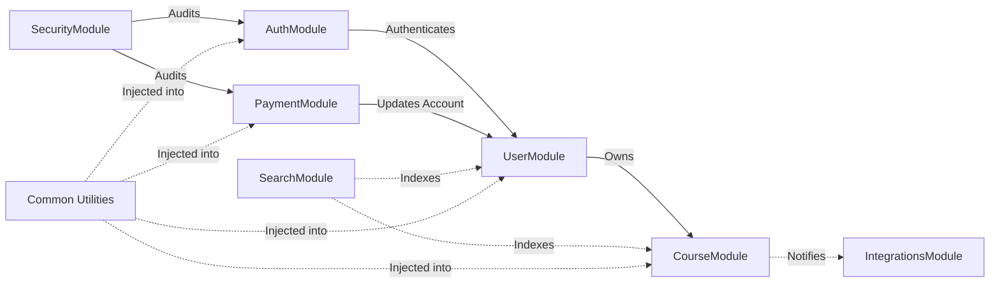

# Module Interactions

This document explains the internal communication and dependencies between core modules in the StrellerMinds-Backend.

## Key Dependencies

The following diagram shows the primary dependencies between modules.

## Core Module Responsibilities

### AuthModule
- **Role**: Entry point for all secure operations.
- **Interactions**:
  - Validates credentials against the `User` entity.
  - Generates JWT tokens used in all other controllers.
  - Implements the `JwtAuthGuard` that protects routes project-wide.

### UserModule
- **Role**: Manages user profiles, preferences, achievements, and social circles.
- **Interactions**:
  - Provides core user data to `AuthModule` during login.
  - Receives payment status updates from `PaymentModule`.
  - Sends updated profile data to `SearchModule` for indexing.

### CourseModule
- **Role**: Core education logic, course content, learning paths, and progress tracking.
- **Interactions**:
  - Depends on `UserModule` for instructor information.
  - Integrates with `VideoModule` for content streaming.
  - Sends course metadata to `SearchModule` for user discovery.

### PaymentModule
- **Role**: Financial transactions and subscription management.
- **Interactions**:
  - Updates the user's subscription tier in `UserModule` upon successful payment.
  - Logs transaction audits to `SecurityModule`.

### IntegrationsModule
- **Role**: Handling third-party services and blockchain operations.
- **Interactions**:
  - Called by `CourseModule` to sync progress to external platforms.
  - Handles the Stellar SDK for blockchain-related tasks.

## Communication Patterns

### 1. Direct Dependency Injection
Modules import services from other modules when direct, synchronous cooperation is required.

### 2. Event-Driven Communication
Used for asynchronous tasks to decouple modules. For example, when a user finishes a course, the `CourseModule` emits a `course.completed` event. The `UserModule` listens for this event and awards a badge.

### 3. Shared Entities
Entities are mostly kept within their domain modules. Cross-module relations are handled using standard TypeORM associations (e.g., `Course` has a relation to `UserProfile`).
