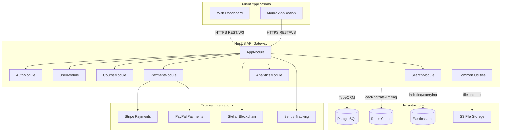

# System Architecture Overview

This document describes the high-level architecture of the StrellerMinds-Backend.

## High-Level Diagram

The following diagram illustrates the interaction between the application components, the storage layer, and the external integrations.

## Architectural Layers

### 1. Controllers (Presentation Layer)
- Responsible for handling incoming HTTP requests.
- Validate request data using `ValidationPipe` and DTOs.
- Delegate business logic to services.
- Handle authentication using `@UseGuards()`.

### 2. Services (Business Logic Layer)
- Contain the core application logic.
- Orchestrate data flow between repositories and external integrations.
- Perform complex calculations and transformations.
- Emit events (using `EventEmitter`) for asynchronous tasks.

### 3. Repositories (Data Access Layer)
- Provided by TypeORM.
- Abstract the database implementation.
- Handle CRUD operations and complex query building.

### 4. Infrastructure
- **PostgreSQL**: Primary data store for structured application state.
- **Redis**: Used for session management, rate limiting, and performance caching.
- **Elasticsearch**: Powering advanced search discovery and results.
- **S3 / Local Storage**: Storing and serving static files (course videos, profile photos).

## Cross-Cutting Concerns
- **Authentication**: JWT-based auth via `AuthModule`.
- **Authorization**: Role-based access control (RBAC) via `@Roles()` decorators.
- **Validation**: Strict input validation using `class-validator` and `class-transformer`.
- **Caching**: Global and specific caching strategies implemented with `Redis`.
- **Logging**: Centralized logging via `WinstonModule` and `RequestLoggerMiddleware`.
- **Health**: Automated system health monitoring via `/api/health`.
